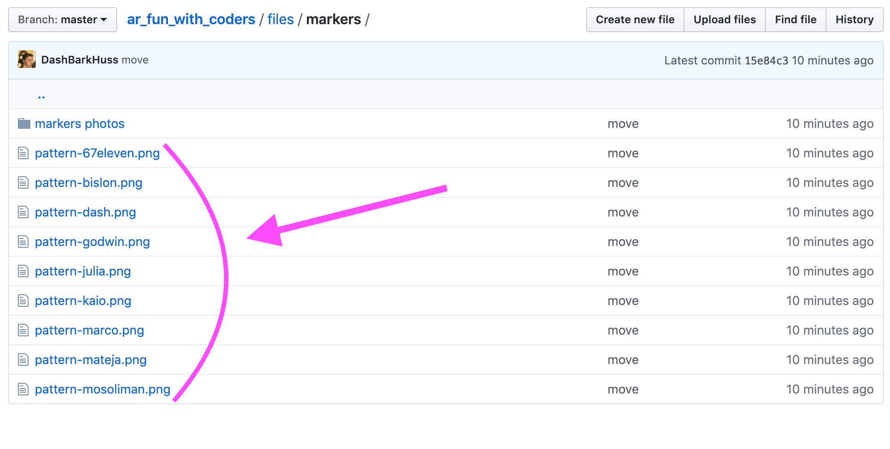

# AR Fun With Coders
This project uses [ar.js](https://github.com/jeromeetienne/AR.js/blob/master/README.md), and augmented reality javascript library. 

When shown to the camera, **"markers"** linked to different coders (my coding friends on twitter) will cue the code to display an image of that coder.

## Download the markers
Markers are the black and white images I have on my phone in the gif above.

You need to download the markers and print them out or put them somewhere the camera can see.

The markers can be found [here](https://github.com/DashBarkHuss/ar_fun_with_coders/tree/master/files/marker):

## Note About Markers
It seems the more markers you have the more finicky ar.js is. I believe this is because ar.js is trying to decipher between all of the markers. Also the glare on your phone may interfere with the programs ability to clearly "see" the marker.

## Tutorials for AR.js
- [Building AR/VR with Javascript and HTML](https://blog.halolabs.io/building-ar-vr-with-javascript-and-html-97af4434bcf6)
- [Creating Augmented Reality with AR.js and A-Frame](https://aframe.io/blog/arjs/)
- [How To Create your Own Marker ?](https://medium.com/arjs/how-to-create-your-own-marker-44becbec1105)

## Show Me What You Made

If you add yourself or make something inspired by this project, tweet me [@DashBarkHuss](https://twitter.com/DashBarkHuss). I'd love to check it out.